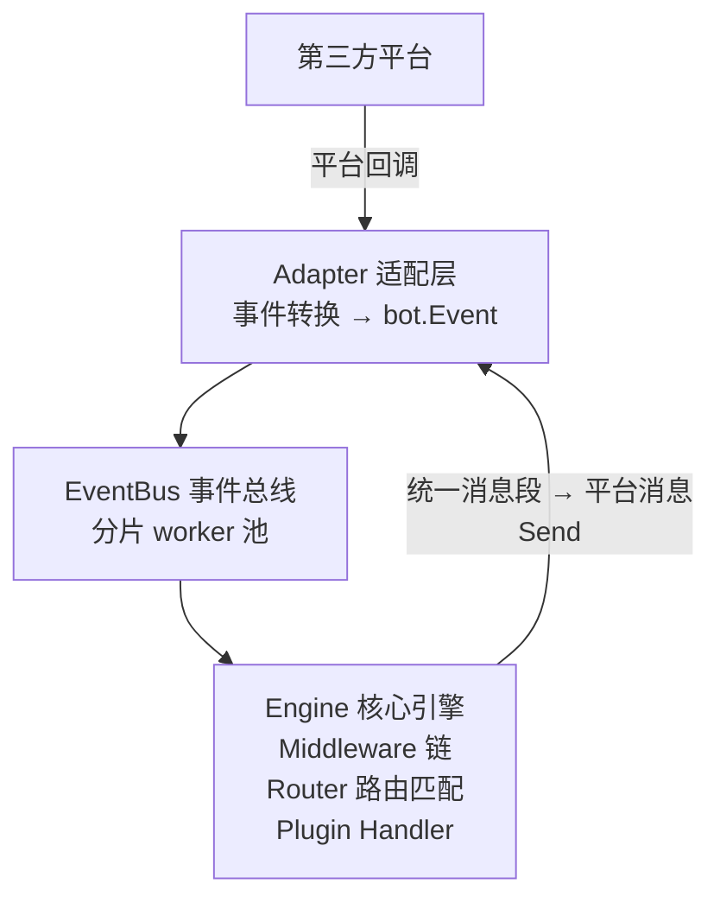

# kei

高性能聊天机器人框架。

## Advantages

- 高性能：依托于 `Go` 的高性能，`kei` 可以实现更快的处理速度、更低的内存占用、更少的环境依赖。
- 易开发：文档齐全——用户指南见本文件，设计与实现说明见 [`docs/`](docs/README.md)（含[目录结构与架构概览](docs/architecture.md)），硬性规则见 [`AGENTS.md`](AGENTS.md)。
- 可闭源：编译式运行，可以仅发布二进制，不过我们还是希望您可以开源。

## Architecture



- **统一消息段**：文本、Markdown、图片、At、表情、引用、卡片、文件都归一为 `bot.Segment`，
  平台不支持时由 `bot.Degrade` 自动降级。
- **事件总线**：`platform:botID:channelID:userID` 哈希分片，同一会话严格保序，不同会话并行；
  `事件 ID + TTL` 去重；优雅关闭前排空已入队事件。
- **中间件**：Recover / Logger / Metrics / Timeout / Auth / RateLimit / Dedup 可组合，洋葱模型。
- **插件**：插件通过 `init()` 注册、配置启用，只依赖 `pkg/bot`，核心不因插件崩溃而退出。
- **零第三方运行时依赖**：仅 `gopkg.in/yaml.v3`。

## 目录结构

```text
kei/
├── cmd/
│   └── bot/               入口薄壳：flag + 信号 + 空导入 + 一次 kei.Run（无装配逻辑）
├── pkg/
│   ├── bot/               公开 SDK：Event/Message/Adapter 注册表/Plugin/Registrar/Reply/BotAPI
│   ├── message/           消息段构建器
│   └── kei/               装配门面：加载配置、装配适配器与插件、启动引擎、优雅退出
├── internal/
│   ├── engine/            核心引擎（BotAPI 实现、发送限流与重试、优雅关闭）
│   ├── eventbus/          事件总线（分片保序、去重、drain）
│   ├── router/            路由匹配与 Registrar 实现
│   ├── middleware/        中间件（Recover/Logger/Metrics/Timeout/Auth/RateLimit/Dedup）
│   ├── metrics/           Prometheus 文本指标（标准库实现）
│   ├── pluginmgr/         插件生命周期管理
│   ├── adaptermgr/        适配器装配：注册表查表、权限裁剪、保留键校验
│   ├── config/            YAML 配置加载与环境变量覆盖
│   ├── storage/           bot.Storage 内存实现
│   ├── dedup/             带 TTL 与容量的去重集合
│   └── ratelimit/         按 key 的令牌桶（非阻塞 Allow + 阻塞 Wait）
├── adapters/
│   ├── mock/              本地测试适配器（HTTP 控制面注入事件、观察发送）
│   ├── onebot/            OneBot v11（按 mode 选 HTTP 双向 / 反向 WebSocket / 正向 WebSocket，零第三方依赖）
│   └── feishu/            飞书开放平台（事件订阅回调 + 消息发送）
├── plugins/
│   ├── echo/              示例插件：/echo
│   └── manage/            管理命令：/ping、/version、/plugins、/adapters、/admin
├── examples/
│   └── kei-adapter-myim/  独立 module 的第三方适配器示例（只依赖 pkg/bot）
├── configs/
│   └── config.yaml        示例配置
└── docs/                  设计文档集（架构/领域模型/适配器/插件/引擎/配置/测试/阶段现状）
```

## 环境准备（Nix + direnv）

Go 工具链、`gopls`、`golangci-lint`、`dlv` 全部由 flake 提供，不需要在系统里装 Go。

```bash
# 方式一：direnv（推荐，进入目录自动加载 / 离开自动还原）
direnv allow .          # 首次执行一次；之后 cd 进目录即自动生效
go version              # go1.26.7（来自 flake devShell）

# 方式二：显式进入 devShell
nix develop
nix develop --command go test -race ./...

# 可选：安装 nix-direnv 可让 devShell 复用缓存与 GC root（.envrc 会自动识别）
```

`flake.nix` 提供的输入：

| 用途 | 命令 |
| --- | --- |
| 开发环境 | `nix develop` |
| 构建二进制（含 `go test`） | `nix build` → `result/bin/bot` |
| 直接运行 | `nix run . -- -config configs/config.yaml` |
| 格式化 flake | `nix fmt` |
| 校验 flake | `nix flake check` |

`GOTOOLCHAIN=local` 已在 devShell 中固定，Go 不会去下载别的 toolchain。

## 快速开始

```bash
# 1) 启动（示例配置默认只跑 mock 适配器 + echo/manage 插件）
nix develop --command go run ./cmd/bot -config configs/config.yaml

# 2) 另开一个终端：注入一条命令事件
curl -sS -XPOST 127.0.0.1:18080/inject \
  -H 'content-type: application/json' \
  -d '{"text":"/echo hello kei"}'
# {"event_id":"mock-..."}

# 3) 查看机器人实际发出的消息
curl -sS 127.0.0.1:18080/sent | jq '.[0].Request.Message.Segments'
# [{"Type":"text","Data":{"text":"hello kei"}}]

# 4) 查看指标
curl -sS 127.0.0.1:19090/metrics | grep kei_events

# 5) Ctrl-C 优雅退出（停止接收 → 排空已入队事件 → 停止适配器 → 停止插件）
```

`adapters/mock` 的 HTTP 控制面（仅在配置了 `listen_addr` 时启动）：

| 方法/路径 | 说明 |
| --- | --- |
| `POST /inject` | 注入事件，JSON 字段：`text`/`user_id`/`user_name`/`channel_id`/`kind`/`id`/`type`；返回 `202` |
| `GET /sent` | 已发送消息记录（含结果与错误） |
| `DELETE /sent` | 清空记录 |
| `GET /healthz` | 存活检查 |

## 创建一个新 chatbot

`cmd/bot` 是通用入口，装配全部委托给 [`pkg/kei`](pkg/kei)（装配门面），由注册表 + 配置驱动。
**多数情况下创建一个 bot 只需要一份配置，不写代码**；只有「平台不在内置适配器列表」或
「需要自定义业务逻辑」才动手写代码。完整流程：

**0. 先选启动方式：CLI 还是代码内嵌入**

两种方式共用同一套 YAML 配置与注册表装配，只是入口不同。

- **命令行**：`go run ./cmd/bot -config configs/mybot.yaml`（下方步骤 1–7 的默认路径）。
- **代码内（import + 几行代码）**：把 chatbot 嵌进已有服务，只写 go import 与 `kei.Run`：

  ```go
  package main

  import (
  	"context"
  	"log"

  	kei "github.com/RandomLemon/kei/pkg/kei"

  	// 空导入决定适配器/插件是否编译进二进制，是否启用由配置决定。
  	_ "github.com/RandomLemon/kei/adapters/mock"
  	_ "github.com/RandomLemon/kei/adapters/onebot"
  	_ "github.com/RandomLemon/kei/plugins/echo"
  )

  func main() {
  	if err := kei.Run(context.Background(), kei.Options{ConfigFile: "configs/mybot.yaml"}); err != nil {
  		log.Fatal(err)
  	}
  }
  ```

  配置也可以内联，配合 `go:embed` 做单二进制分发：

  ```go
  //go:embed configs/mybot.yaml
  var cfg []byte

  // ...
  kei.Run(ctx, kei.Options{Config: cfg})
  ```

  `Options` 只提供依赖注入点（`Logger`/`HTTPClient`/`Storage`/`Plugins`），配置语义完全由 YAML
  决定，不新建第二套配置。`Options.Plugins` 可直接注入 `*bot.FuncPlugin`（见「写一个插件」的内联
  写法）。`ConfigFile` 与 `Config` 二选一必填：都不给时 `Run` 直接报错，不会静默回落默认路径。

**1. 跑通环境与骨架**

```bash
direnv allow .                       # 首次；之后进入目录自动加载，或显式 nix develop
nix develop --command go run ./cmd/bot -config configs/config.yaml

# 另开终端：注入 /echo 并观察实际发出的消息
curl -sS -XPOST 127.0.0.1:18080/inject -H 'content-type: application/json' \
  -d '{"text":"/echo hello"}'
curl -sS 127.0.0.1:18080/sent | jq '.[0].Request.Message.Segments'
```

**2. 复制配置并选平台**

```bash
cp configs/config.yaml configs/mybot.yaml   # 保留需要的 bots[]/plugins，删除其余
```

`bots[].adapter` 决定用哪个适配器，按需求分支：

| 需求 | 做法 |
| --- | --- |
| 平台已内置（`mock`/`onebot`/`feishu`） | 只填 `bots[]` 配置，见「配置」与「写一个适配器」的接入小节 |
| 平台无内置适配器（含企业微信） | 写适配器：独立包/独立 module 调 `bot.RegisterAdapter`（见「写一个适配器」），核心零改动 |
| 本地联调 | 用 `mock` 适配器注入事件、观察发送，无需真实平台 |

平台凭证只经配置读取，密钥用环境变量覆盖而不落盘（见「环境变量覆盖」）：

```bash
KEI_BOTS_FEISHU_MAIN_APP_SECRET=xxx \
  nix develop --command go run ./cmd/bot -config configs/mybot.yaml
```

**3. 实现业务逻辑（插件）**

需要自定义逻辑时新增插件：在 `plugins/<name>/` 实现 `bot.Plugin`
（`Metadata`/`Setup`/`Start`/`Stop`），在 `init()` 中 `bot.RegisterPlugin(...)`，
并只在 `Setup` 里经 `bot.Registrar` 注册触发规则（命令/正则/关键词/事件/兜底）。
接口与规则语义见「写一个插件」。

**4. 装配入口（空导入）**

适配器与插件都是注册表驱动：入口程序空导入其包即完成注册，是否启用由配置决定。

- 仓库内新增插件：仿照 `plugins/echo`，在 `cmd/bot/main.go` 的 import 块加一行
  `_ "github.com/RandomLemon/kei/plugins/<name>"`。
- 第三方插件：放在独立包或独立 module，只依赖 `pkg/bot`，同样在 `init()` 注册，核心零改动。

**5. 启用并在本地验证**

```yaml
plugins:
  echo:     { enabled: true }   # 也可简写为 echo: true
  <name>:   { enabled: true }
```

- 注入一次事件，确认 `/sent`（mock）或平台侧收到回复。
- 用管理命令检查装配：`/plugins`（已加载插件）、`/adapters`（适配器与每个 bot 的绑定）；五条管理命令的契约与配置见 [`docs/plugins/manage.md`](docs/plugins/manage.md)。
- 插件单测无需启动引擎：`bot.NewRecordingRegistrar()` + `bot.NewNoopReply()`，
  见「写一个插件」末尾。
- 同一平台配多个 bot（多账号）时，主动发送必须显式指定 `Target.BotID`。

**6. 权限、限流与多账号**

插件按需声明权限（`PermNetwork`/`PermStorage`/`PermSendMessage` 等），未声明时对应能力被
裁剪；限流、管理员名单与 `bots[].plugins` 白名单见「配置」的 `limits`/`auth`/`bots` 要点。

**7. 质量门与发布**

```bash
nix develop --command gofmt -l .     # 必须无输出
nix develop --command go vet ./...
nix develop --command go test -race ./...
nix build                            # → result/bin/bot
./result/bin/bot -config configs/mybot.yaml
```

上线后的指标、优雅退出与当前边界分别见「可观测性」「已知限制」两节。

## 配置

`configs/config.yaml` 是完整示例。结构：

```yaml
log:     { level: info, format: text }     # text | json
metrics: { addr: 127.0.0.1:19090 }         # 空表示不暴露
limits:  { handler_rate: 0, send_rate: 0 } # 0 表示不限流
auth:    { admin_users: [] }               # 配合 bot.WithAdmin() 规则
adapters:                                # 可选：启用/禁用适配器（仅支持 enabled 键）
  feishu:  { enabled: false }            # 示例：禁用内置适配器（其 bot 一并跳过）
bots:
  - name: mock-main
    adapter: mock
    platform: mock
    listen_addr: 127.0.0.1:18080
plugins:
  echo:    { enabled: true }
  manage:  { enabled: true }
```

要点：

- `bots[].adapter` 决定使用哪个适配器，其余键按适配器要求传入（拼错会打 warn 日志）。
- `bots[].enabled` 是实例级开关，**缺省 true**：写 `enabled: false` 只跳过该实例
  （不装配、不监听、不接收事件），可用于临时停用某个账号；也可用
  `KEI_BOTS_<BOTNAME>_ENABLED=false` 覆盖（bot 名规范化后比较，`feishu-main` 即
  `KEI_BOTS_FEISHU_MAIN_ENABLED`）。
- 同一个平台可以配置多个 bot（例如两个飞书应用），此时发送必须显式指定 `Target.BotID`。
- `bots[].plugins` 是该 bot 的插件白名单；只要有一个 bot 配置了非空白名单，规则就会按
  「哪些 bot 允许它」收窄（未配置白名单的 bot 允许全部）。
- `plugins.<name>` 未列出 = 不启用；想启用必须写 `enabled: true`。
- `adapters.<name>` 段可选，且只支持 `enabled` 键：进程内适配器只靠 `bots[].adapter`
  引用即可工作，此处仅用于显式启用/禁用。`enabled` **缺省 true**（与插件相反）：写
  `enabled: false` 即不加载该适配器，其 `bots[]` 条目一并跳过（每个跳过的 bot 记 warn）。

### 环境变量覆盖

任意配置项都可以用 `KEI_` 前缀覆盖：路径段用 `_` 连接、忽略大小写，`-`/`.` 等价于 `_`。

```bash
KEI_LOG_LEVEL=debug
KEI_METRICS_ADDR=127.0.0.1:9090
KEI_LIMITS_SEND_RATE=5
KEI_AUTH_ADMIN_USERS=ou_xxx,123456
KEI_BOTS_FEISHU_MAIN_APP_SECRET=xxx      # bot 名 feishu-main → 其 app_secret
KEI_PLUGINS_WEATHER_API_KEY=xxx
```

值的类型按 YAML 规则推断（`true`→bool、`3`→int、其余→string），所以 `enabled: "false"` 也能生效。
未匹配任何已知路径的 `KEI_*` 变量会被忽略。

## 写一个插件

插件只依赖 `pkg/bot`，通过 `init()` 注册，由配置启用。

```go
package hello

import (
	"context"

	"github.com/RandomLemon/kei/pkg/bot"
)

type Plugin struct{}

func (p *Plugin) Metadata() bot.Metadata {
	return bot.Metadata{
		Name: "hello", Version: "v0.1.0", Author: "you",
		Description: "打招呼",
		Permissions: []bot.Permission{bot.PermNetwork, bot.PermStorage},
	}
}

func (p *Plugin) Setup(ctx context.Context, reg bot.Registrar) error {
	// 命令触发：/hello <名字>
	reg.OnCommand("hello", func(ctx context.Context, e *bot.Event, r bot.Reply) error {
		return r.Text("你好！").Send(ctx)
	}, bot.WithPriority(100))

	// 正则触发（捕获组通过 bot.RouteFrom(ctx).RegexMatches 读取）
	reg.OnRegex(`^你好\s+(\S+)$`, func(ctx context.Context, e *bot.Event, r bot.Reply) error {
		name := "世界"
		if rt, ok := bot.RouteFrom(ctx); ok && len(rt.RegexMatches) > 1 {
			name = rt.RegexMatches[1]
		}
		return r.Text("你好，" + name).Send(ctx)
	})

	// 关键词触发
	reg.OnKeyword([]string{"help", "帮助"}, func(ctx context.Context, e *bot.Event, r bot.Reply) error {
		return r.Text("可用命令：/hello").Send(ctx)
	})

	// 事件类型触发
	reg.OnEvent(bot.EventNotice, func(ctx context.Context, e *bot.Event, r bot.Reply) error {
		return nil
	})

	// 兜底：处理所有没被上面条件排除的消息
	reg.OnAll(func(ctx context.Context, e *bot.Event, r bot.Reply) error { return nil },
		bot.WithPriority(-100))

	return nil
}

func (p *Plugin) Start(context.Context) error { return nil }
func (p *Plugin) Stop(context.Context) error  { return nil }

func init() { bot.RegisterPlugin(&Plugin{}) }
```

不想为一段逻辑单独建包时，用 `bot.FuncPlugin` 内联实现，再经 `kei.Options.Plugins` 注入
（它不进入编译期注册表，只用于代码内启动）：

```go
p := &bot.FuncPlugin{
	Meta: bot.Metadata{Name: "hello", Version: "v0.1.0"},
	OnSetup: func(ctx context.Context, reg bot.Registrar) error {
		reg.OnCommand("hello", func(ctx context.Context, e *bot.Event, r bot.Reply) error {
			return r.Text("你好！").Send(ctx)
		})
		return nil
	},
	// OnStart / OnStop 为 nil 时是空实现。
}
kei.Run(ctx, kei.Options{ConfigFile: "configs/mybot.yaml", Plugins: []bot.Plugin{p}})
```

注入的实例一律启用：配置里没有同名键时自动补 `enabled: true`；同名键必须 `enabled`，
否则 `Run` 报错。同名时注入实例优先，注册表登记的同名实例被跳过。

规则语义：

- 同一事件可以命中**多条**规则，按 `Priority` 降序依次执行（同优先级按注册顺序）；
  多插件协作时用 `WithPriority(-100)` 之类把兜底逻辑放到最后。
- 过滤条件之间是「与」：`WithPlatforms`/`WithKind`/`WithBotIDs`/`WithMatch` 可自由组合。
- 每个插件可以用 `reg.Use(mw)` 追加自己的中间件（只影响其后注册的规则）。
- 插件运行期依赖通过 `bot.PluginContextFrom(ctx)` 获取：

  | 字段 | 说明 |
  | --- | --- |
  | `Config` | 该插件在 `plugins.<name>` 下的配置（`Get/String/Bool/Int/Duration/Strings/Unmarshal`） |
  | `Logger` | 已绑定 `plugin` 字段的 `*slog.Logger` |
  | `Storage` | 键值存储（未声明 `PermStorage` 时返回拒绝访问的实现） |
  | `HTTPClient` | 带超时的 HTTP 客户端（未声明 `PermNetwork` 时为 nil） |
  | `Bot` | 唯一的平台出口（`Send` 需要 `PermSendMessage`，`Reply` 始终可用） |
  | `Catalog` | 已加载插件元信息（`/plugins` 这类管理命令用） |

插件可以只用 `pkg/bot` 做单元测试，无需启动引擎：

```go
reg := bot.NewRecordingRegistrar()
_ = (&Plugin{}).Setup(ctx, reg)
rule, _ := reg.Command("hello")
reply := bot.NewNoopReply()
_ = rule.Handler(ctx, ev, reply)
fmt.Println(reply.PlainText())
```

## 写一个适配器

```go
type Adapter interface {
	Name() string
	Start(ctx context.Context, sink EventSink) error // 阻塞直到 ctx 结束
	Stop(ctx context.Context) error
	Send(ctx context.Context, req *SendRequest) (*SendResult, error)
	Capabilities() Capabilities
}
```

约定：

- `Start` 必须在返回前完成监听/连接，随后阻塞到 `ctx.Done()`；`Stop` 幂等。
- 平台回调要在超时前返回（飞书 3 秒），业务事件经 `sink.Emit` 异步投递。
- 用 `bot.Key*` 常量读写 `Segment.Data`，不要写字面量键。
- 发送前调用 `bot.Degrade(msg, a.Capabilities())`，平台不支持的消息段会自动降级为文本。
- `Event.ID` 用于去重，必须稳定（飞书用 `header.event_id`，OneBot 用 `message_id`）。

已内置的适配器与能力：

| 适配器 | 接入方式 | 能力 |
| --- | --- | --- |
| `mock` | HTTP 控制面注入/观察 | 全能力，用于本地联调与测试 |
| `onebot` | 按 `mode` 选择 HTTP 双向（HTTP 上报 + HTTP API）/ 反向 WebSocket / 正向 WebSocket；发送优先走 WebSocket 连接，否则回落 HTTP API | 文本/图片/At/表情/引用/文件；不支持 Markdown、卡片 |
| `feishu` | 事件订阅回调（challenge、签名校验、AES 解密、3s 内 ACK）+ 开放平台 API | 文本/Markdown/图片/At/卡片/引用/文件 |

### OneBot v11 的接入方式

`mode` 四选一，一次只启用一种，缺省 `reverse_ws`；与所选 mode 无关的键会被忽略并记
一条 warn，因此同一份配置可以保留全部方式的键、只改 `mode`。发送优先级固定为
「可用 WebSocket 连接 → `api_url` → 报错」，与 `mode` 无关：

| `mode` | 事件入站 | 发送 |
| --- | --- | --- |
| `forward_http` / `reverse_http`（同义） | 本进程监听 `listen_addr` + `path`，接收 HTTP 上报（POST JSON） | `api_url` 的 HTTP API |
| `reverse_ws`（缺省） | 本进程监听 `listen_addr` + `ws_path`，OneBot 主动连入 | 优先经该连接（按 `echo` 匹配响应） |
| `forward_ws` | 本端主动连 `ws_url`，不监听任何端口 | 优先经该连接 |

```yaml
bots:
  - name: qq-main
    adapter: onebot
    mode: reverse_ws                 # forward_http / reverse_http / forward_ws / reverse_ws
    api_url: http://127.0.0.1:3000   # HTTP API；forward_http/reverse_http 下必填
    listen_addr: 127.0.0.1:18082     # HTTP 上报与反向 WebSocket 的监听地址
    path: /onebot/event              # HTTP 上报路径，默认 /onebot/event
    ws_path: /onebot/ws              # 反向 WebSocket 路径，默认 /onebot/ws
    ws_url: ""                       # 正向 WebSocket 地址，如 ws://127.0.0.1:6700；forward_ws 下必填
    ping_interval: 30s               # 心跳间隔，默认 30s；负值关闭心跳（两种 WebSocket 都生效）
    secret: ""                       # 非空时两条入站通道都要带同一令牌
    self_id: ""                      # 非空时只接受 X-Self-ID 一致的连接
```

在 OneBot 实现里把反向 WebSocket 地址配置为 `ws://127.0.0.1:18082/onebot/ws`
（`secret` 非空时加 `?access_token=<secret>`，或用 `Authorization: Bearer` 头）；
`forward_ws` 则反过来把 OneBot 实现的 WebSocket 服务端地址填进 `ws_url`。
行为要点：

- 事件收到即投递（反向 WebSocket 没有回应帧，不存在 ACK 超时）；分片消息会先重组，
  二进制帧按 JSON 解析，`Event.ID` 与 HTTP 上报路径完全一致，去重不受通道影响。
- 发送经 WebSocket 连接下发并按 `echo` 精确匹配响应，因此同一条连接可以并行等待
  多次发送；连接断开会让等待中的发送立即失败，而不是等到 `context` 超时。
- `X-Client-Role` 为 `event` 的连接只用于接收事件，不会被选中发送；未声明角色按
  `universal` 处理。`self_id` 非空时，`X-Self-ID` 不一致的连接会被拒绝（403）。
- 心跳（ping）用于发现半开连接：连续两个心跳周期收不到任何帧即回收该连接，
  之后发送回落到 HTTP API。多连接时发送固定走最早建立的连接。
- `forward_ws` 断线后按 1s→30s 指数退避自动重连，连接建立即重置退避；该模式不监听
  任何端口（`Addr()` 恒为空串）。


适配器与插件一样由注册表驱动：适配器在自己的包内 `init()` 注册「元信息 + 工厂」，
主程序只做空导入，`bots[].adapter` 按注册名装配。因此第三方适配器可以是独立包或
独立 module（只依赖 `pkg/bot`），**核心仓库无需任何改动**。

```go
package myim

func init() {
	bot.RegisterAdapter(bot.AdapterMetadata{
		Name:        "myim",
		Version:     "v0.1.0",
		Author:      "third-party",
		Description: "MyIM 平台适配器",
		Platforms:   []string{"myim"},                                 // 写入 Event.Platform
		Permissions: []bot.Permission{bot.PermNetwork, bot.PermNetListen},
		Options:     []string{"api_base", "listen_addr"},              // 未知配置键会告警
	}, New)
}

// New 每个 bot 实例调用一次，必须是互相隔离的实例。
func New(ac bot.AdapterContext) (bot.Adapter, error) {
	if ac.HTTPClient == nil {
		return nil, errors.New("myim: 未声明 network 权限")
	}
	return &Adapter{
		botID:   ac.BotID,                                  // 必须写入 Event.BotID / SendRequest.BotID
		apiBase: ac.Config.String("api_base", ""),
		http:    ac.HTTPClient,
		log:     ac.Logger.With("bot", ac.BotID, "adapter", "myim"),
	}, nil
}
```

启用只需空导入 + 配置：

```yaml
bots:
  - name: myim-main
    adapter: myim
    api_base: https://im.example.com
    listen_addr: 127.0.0.1:18091
```

权限由核心在装配期裁剪，声明必须如实：

| 权限 | 拿到什么 | 未声明时 |
| --- | --- | --- |
| `network` | `AdapterContext.HTTPClient` | 为 `nil`，工厂应报错而不是回落到自带客户端 |
| `storage` | `AdapterContext.Storage` | 注入拒绝式存储（`ErrPermissionDenied`） |
| `net_listen` | 允许监听入站端口 | 配置里出现保留键 `listen_addr` 时启动失败 |

`/adapters` 会列出已注册适配器与每个 bot 的绑定关系（每个绑定一行 `- <botID> → <adapterName>`；两段列表可以不一致，原因见 [`docs/plugins/manage.md`](docs/plugins/manage.md) 3.4 节）。

临时停用某个平台不用删配置，加一行即可（其 `bots[]` 条目一并跳过）：

```yaml
adapters:
  feishu: { enabled: false }   # 缺省为 true；也可用 KEI_ADAPTERS_FEISHU_ENABLED=false
```

独立 module 形式（推荐给第三方）：

```text
kei-adapter-myim/
├── go.mod      # module github.com/example/kei-adapter-myim；require github.com/RandomLemon/kei
├── myim.go     # 实现 bot.Adapter
├── register.go # init() 中 RegisterAdapter
└── README.md
```

仓库内提供了可运行的完整示例 [`examples/kei-adapter-myim/`](examples/kei-adapter-myim/)：它是一个独立
`go.mod` 的 module，只依赖 `pkg/bot`（不 import `internal/`），在 `init()` 中注册 `myim`
适配器。在仓库内它以 `replace github.com/RandomLemon/kei => ../..` 指向本地根 module；
真实第三方仓库把它换成版本号即可。运行示例自己的测试：

```bash
cd examples/kei-adapter-myim && go test ./...
```

## 可观测性

- `GET /metrics`（`metrics.addr`）暴露 Prometheus 文本指标：

  | 指标 | 标签 |
  | --- | --- |
  | `kei_events_published_total` | `platform` |
  | `kei_events_dropped_total` | `platform`, `reason` |
  | `kei_events_handled_total` | `plugin`, `rule`, `result` |
  | `kei_event_handling_seconds`（直方图） | `plugin`, `rule` |
  | `kei_messages_sent_total` | `platform`, `result` |
  | `kei_message_send_seconds`（直方图） | `platform` |
  | `kei_rules_matched_total` | `plugin`, `rule` |

- 日志用 `log/slog`，字段化输出（`plugin`/`rule`/`event_id`/`duration_ms`/`error`），
  `log.format: json` 可切换为 JSON。

## 测试与验证

```bash
nix develop --command go build ./...
nix develop --command go vet ./...
nix develop --command go test ./...
nix develop --command go test -race ./...
```

测试覆盖：命令/正则/关键词/事件触发、优先级与中间件顺序、panic 恢复、超时、
事件去重、同会话保序、优雅关闭排空、发送限流与重试、能力降级、
Mock→EventBus→Router→Plugin→Reply 全链路集成、飞书回调（challenge/签名/AES 解密/ACK）、
OneBot 事件与 API、OneBot 反向 WebSocket（握手/Accept 校验、鉴权、事件上行与分片重组、
按 echo 并行发送、role/self_id 过滤、心跳与半开连接回收、协议错误、停止时关闭连接）、
OneBot 正向 WebSocket（握手校验、掩码方向、事件上行、按 echo 发送、断线重连）。

## 已知限制

- 个人微信逆向协议不支持（`adapters/wecom` 尚未实现，企业微信可参考飞书适配器结构接入）。
- `BotAPI` 没有 `reply_to` 参数：插件回复当前会话无法携带引用；需要引用时用
  `Engine.SendRequest`。
- 同一平台配置多个 bot 时，主动发送必须在 `bot.Target.BotID` 指定 bot 名称；
  不指定则只有该平台仅有一个 bot 时才能自动选择。
- `Storage` 为内存实现，重启即丢失；生产可替换为 Redis/SQLite（实现 `bot.Storage` 即可）。
- OneBot 一个 bot 实例同一时刻只启用一种接入方式（`mode`）：HTTP 双向用
  `forward_http`/`reverse_http`，`reverse_ws` 由 OneBot 实现连入，`forward_ws` 由 kei
  主动连出且不监听端口。一个 bot 实例只服务一个账号（`self_id` 非空时按 `X-Self-ID`
  过滤），多个账号请为每个账号配置一个 bot 实例。
